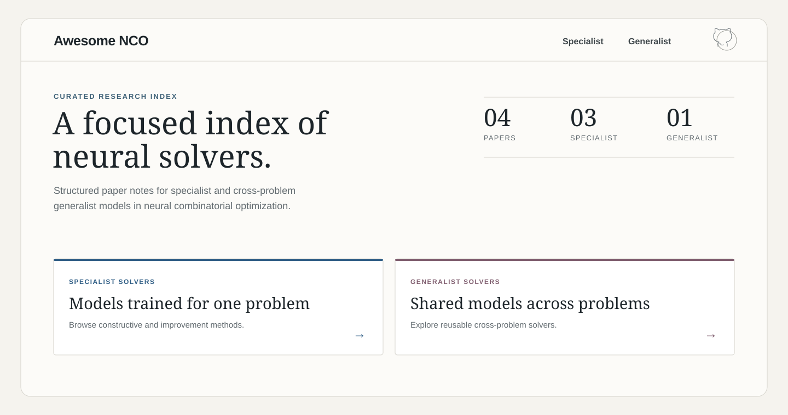

# Awesome Neural Combinatorial Optimization

A structured research index for neural combinatorial optimization.

[Website](https://ciam-group.github.io/awesome-nco/) · [Specialist Neural Solvers](specialist/README.md) · [Generalist Neural Solvers](generalist/README.md) · [Contributing](CONTRIBUTING.md)

Awesome NCO is designed as a research index rather than a flat bibliography. Paper metadata powers a searchable website and maintainable repository indexes, while every paper has a structured note covering its motivation, contributions, methodology, experiments, limitations, and reproducibility.

> [!NOTE]
> The collection is at an early stage and currently contains a small set of representative papers.

## Highlights

- A clear distinction between **specialist** models trained for one optimization problem and **generalist** models shared across multiple problems.
- A consistent method label for every paper: **Constructive**, **Improvement**, or **Constructive + Improvement**.
- One Markdown file per paper with machine-readable YAML Front Matter.
- Author-reported limitations are separated from curator observations.
- The website, timelines, filters, and category indexes are generated from the same paper metadata.

## Browse the Collection

### [Specialist Neural Solvers](specialist/README.md)

Models trained separately for individual optimization problems. Generalization across sizes or distributions within the same problem remains specialist generalization in this taxonomy.

### [Generalist Neural Solvers](generalist/README.md)

Shared models or checkpoints that solve multiple distinct optimization problems, optionally through lightweight task-specific adapters.

## Website

The [Awesome NCO website](https://ciam-group.github.io/awesome-nco/) provides separate Specialist and Generalist timelines, full-text search, filters, and rendered paper notes.

[](https://ciam-group.github.io/awesome-nco/)

## How to Use

1. Open the Specialist or Generalist collection on the website or in this repository.
2. Search by title, author, venue, institution, or optimization problem.
3. Filter by solver paradigm, problem family, or first-public year.
4. Select a paper to open its structured research note and original resources.

## Contributing

Adding a paper requires one Markdown file:

1. Copy [the paper template](docs/PAPER_TEMPLATE.md).
2. Place the new file in `specialist/` or `generalist/`.
3. Complete the YAML Front Matter and research-note sections.
4. Open a pull request. Automated checks validate the content; category indexes and the website are generated automatically.

See [CONTRIBUTING.md](CONTRIBUTING.md) for the inclusion rules, field definitions, and local validation commands.

## Local Development

```bash
npm install
npm run dev
```

Useful checks:

```bash
npm run validate
npm test
npm run build
```

## Repository Structure

```text
.
├── specialist/          Specialist paper notes and scope definition
├── generalist/          Generalist paper notes and scope definition
├── scripts/             Content validation and index generation
├── src/                 Website source
├── tests/               Content, filtering, and visual smoke tests
└── docs/                Contribution template and website assets
```

## License

This repository is released under the [MIT License](LICENSE).
